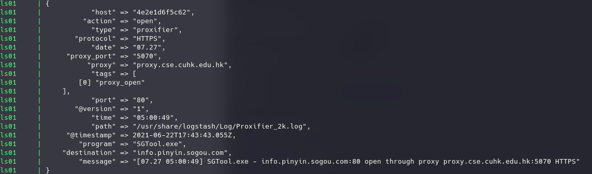

# SZE-FordProg-2021-Elastic
**Bene Robert**

## Naplofajl
A Log mappaban talalhato a Proxifier alkalmazas naplofajlja. Ebben a mappaban talalhato log kerul feldolgozasra.  

A naplofajl a kovetkezo helyrol kerult letoltesre:
https://github.com/logpai/loghub/tree/master/Proxifier

## Kovetelmenyek
 - Docker es docker-compose, valamint Internetkapcsolat a docker image-ek letoltesehez.  
 - A fejlesztes es a teszteles Linux (Manjaro) operacios rendszeren tortent. Javasolt Linux-on futtatni a docker-compose-t. (Windows-on nem kerult tesztelesre, valamint ez a leiras sem ter ki ra.)

## Hasznalat
### Javasolt a Makefile hasznalata:  
 - `make start` - elinditja a docker-compose.yml fajl alapjan a docker container-eket.
 - `make start_verbose` - elinditja a docker-compose.yml fajl alapjan a docker container-eket es kiirja a debug logot az output-ra.
 - `make stop` - leallitja a docker container-eket.
 - `make clean` - torli az elasticsearch adatbazisat a dokcer host-rol (./elastic/data/*), valamint torli a docker container-eket.
 - Eloszor javasolt a `make start_verbose` parancssal inditani a dokcker container-eket.

### A docker containerek elinditasa utan:
 - A docker container-ek inditasat kovetoen, amennyiben a **make start_verbose**-al inditottuk, az alabbi kepen lathato output-okat kapjuk.

 - A Kibana webfelulet elerese: http://localhost:5601
 - A tovabbi hasznalat az alabbi videokban lathato: https://laesze-my.sharepoint.com/:f:/g/personal/bene_robert_hallgato_sze_hu/Etls4JKqO3REj9izz3OpxAEByralLYlB1MNgv8LLQxgTXg?e=Cb5eCK
 
### Megjegyzesek 
 - Az elasticsearch adatbazisa a docker hostrol kerul mount-olasra a docker container-be igy a container leallitasat kovetoen elerheto a docker host-rol.
 - Az elasticsearch elindulasanak hibaja eseten a https://www.elastic.co/guide/en/elasticsearch/reference/current/vm-max-map-count.html leirt modon javasolt atallitani a **vm.max_map_count** erteket.
 - A **./elastic/data** rossz jogosultsaga, valamint user:group owenership-je is okozhatja az Elastic hibajat a futtatas soran.
 - A regularis kifejezesek a **./logstash/patterns/proxifier** fajlban talalhatok.
 - A parse-olast vegzo logstash konfiguracios fajlja a **./logstash/conf.d/proxifier.conf** eleresi uton talalhato.

## Parse-olas
 - A jelenleg kialakitott verzio az osszes naplobejegyzest felparse-olja, a **./logstash/conf.d/proxifier.conf** alapjan a Logstash Grok moduljanak a hasznalatan keresztul.
 - A Grok-nak egyeni mintakat (regularis kifejezeseket) definialtam a **./logstash/conf.d/proxifier.conf** fajlban.
 - Az egyes naplobejegyzesekhez a naploban szereplo informaciok alapjan tag-ek is hozzaadasra kerultek.
    - **proxy_open**
    - **close_connection**
    - **error**
    - **error_connection_failed**
 - A naplobejegyzesek parse-olt formaban is eltarolasra kerulnek az Elasticsearch-ben, igy konnyen, gyorsan kereshetok es szurhetok.
